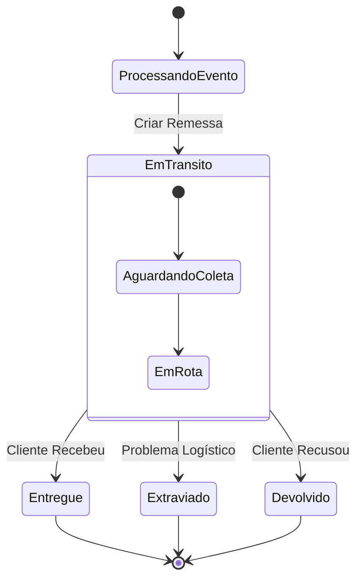

# 🚚 Pet Friends - Logistics Service (Transporte)


> **Microsserviço de Logística e Entregas**
>
> Responsável pelo agendamento de remessas, integração com transportadoras e rastreamento de entregas.

---

## 📖 Visão Geral

O **Transporte Service** é a última milha do ecossistema Pet Friends. Ele é acionado quando um pedido está preparado e embalado. Sua responsabilidade é criar a `Remessa`, definir o status inicial e gerenciar o ciclo de vida até a entrega ao cliente.

### Ciclo de Vida da Remessa



---

## 🏗️ Arquitetura de Domínio
Utilizamos **DDD** para modelar a complexidade logística, isolando a regra de negócio da infraestrutura de mensagens.

* **Agregado Raiz**: `Remessa`
* **Value Objects**: `StatusRemessa` (Controle de estado e auditoria de data)
* **Integração**: Consome `PedidoPreparadoParaEnvioEvent`.

**Estrutura de Pacotes**

```plaintext
br.com.petfriends.transporte
├── application      # Orquestração de eventos
├── domain           # Núcleo da lógica de negócios
│   └── shipping     # Agregado de Remessa
└── infra            # Camada de Infraestrutura
    ├── config       # Configuração de Serialização
    └── events       # Contratos de Eventos (DTOs)
```

---

## 🚀 Como Executar

**Pré-requisitos**

* JDK 21
* Maven 3.8+

**Rodando a Aplicação**

```bash
mvn spring-boot:run
```

**Monitoramento**

O serviço loga automaticamente as solicitações de entrega recebidas:

```plaintext
INFO ... LogisticaEventListener : Solicitação de entrega recebida para PedidoID: ABC-123
INFO ... LogisticaEventListener : Destino: Rua das Flores, São Paulo - SP
```

**Pet Friends Engineering Team** © 2025
